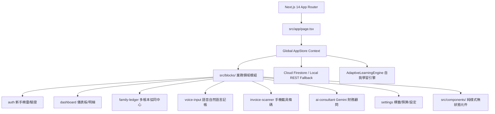

<div align="center">

# 🤖 智帳君 Ledgy
### 台灣在地化 AI 智慧記帳與多人多帳本協同記帳系統
**Full-Stack AI Accounting & Collaborative Multi-Ledger with Real-time Cloud Sync & Native PWA**

[-black?style=for-the-badge&logo=next.js)](https://nextjs.org/)
[](https://www.typescriptlang.org/)
[](https://firebase.google.com/)
[](https://tailwindcss.com/)
[](https://capacitorjs.com/)
[](#)

[🚀 線上即時體驗 Demo](https://ledgy-be1e6.web.app) • [📘 使用者操作教學手冊](./docs/USER_GUIDE.md) • [📄 產品需求規格書 (PRD)](./docs/PRD.md) • [✨ 技術亮點](#-核心技術亮點與架構特色) • [🛠️ 本地建置](#-本地開發與建置指南)

</div>

---

## 📖 專案概述 (Project Overview)

**智帳君 (Ledgy)** 是一款專為台灣用戶打造的高效能、在地化 AI 智慧記帳與多人多帳本協同記帳系統。系統融合了 **手機條碼載具快速出示**、**0-Token 地端/雲端混合式 AI 語音自然語言記帳**、**多人多帳本協同共同編輯與獨立預算管理**，並透過 **PWA 2.0** 與 **Capacitor** 提供 100% 擬真原生 App 體驗。

---

## 🏆 核心技術亮點與架構特色 (Key Architectural Highlights)

### 1. 🧱 高內聚低耦合的清晰分層架構 (Clean Modular Architecture)
為避免傳統前端專案元件與業務邏輯過度混雜，專案嚴格貫徹 **「純樣式 UI 元件」** 與 **「高內聚功能模組 (Blocks)」** 的解耦設計：
- `src/components/`：純無狀態、通用之原子化 UI 元件（按鈕、輸入框、Modal、卡片、徽章等），不依賴任何外部 Store 或業務 API。
- `src/blocks/`：依領域劃分的高內聚業務功能模組，每個 Block 自主封裝其 `views/`（畫面視圖）與 `hooks/`（業務邏輯）：
  - `auth/`：登入、註冊、四步驟新手設定精靈、個人檔案。
  - `dashboard/`：收支儀表板、趨勢圖表、交易清單、預算進度條。
  - `family-ledger/`：多人多帳本中心、共享帳本建立、成員邀請與即時協同編輯。
  - `voice-input/`：Web Speech 語音辨識、麥克風動態反饋、語意結構化預覽。
  - `invoice-scanner/`：手機條碼高對比出示（發票雲端串接與對獎因法規權限考量暫停）。
  - `ai-consultant/`：Gemini 財務諮詢顧問、資產分析對話。
  - `settings/`：食衣住行標籤庫管理、自訂付款方式、多維度預算配置。
  - `layout/`：頂部導航、側邊欄、底部選單、PWA 安裝導引、原生生命週期初始化。
- `src/lib/shared/`：領域模型（Domain Types）、工具函式與通用規則庫。



---

### 2. ⚡ 0-Token 本地/雲端混合式 AI 記帳與自適應學習引擎 (Adaptive Learning Engine)
- **90% 日常記帳 0 毫秒、0 API 成本**：透過在地端建構之 [tagMatcher.ts](file:///Users/huanglingcheng/Documents/記帳app/src/lib/shared/tagMatcher.ts) 與高覆蓋度台灣日常消費詞庫（食、衣、住、行、育、樂、醫、寵），能瞬間解析口語（如：「*吃麥當勞大麥克 160 LINE Pay*」➔ 自動歸入【食】、LINE Pay、160元）。
- **Gemini 2.5 Flash Micro-Prompting**：針對複雜或含糊語句，無縫切換至雲端超輕量 Gemini 生成式解析。
- **自我學習反饋閉環 (Auto-Learning Feedback Loop)**：
  - 當任何未歸類之交易被使用者在 UI 上手動標註/修改標籤時，系統自動提取核心品項/商家關鍵詞，沉澱至 `AdaptiveLearningEngine` 並同步至 Cloud Firestore。
  - 下一次語音或文字記帳時，系統將**優先讀取個人專屬學習記憶，100% 精準自動歸類**。

---

### 3. 🔄 毫秒級 Cloud Firestore 即時雙向同步與離線優先 (Offline-First Real-time Sync)
- **即時監聽 (Real-time Snapshot Listener)**：使用 Firestore `onSnapshot` 建立即時連線通道，手機記帳電腦秒更新、多成員共享帳本即刻同步。
- **全方位個人資料雲端化**：包含標籤庫 (`tagItems`)、總預算與標籤細項預算 (`tagBudgets`)、新手精靈狀態 (`hasCompletedOnboarding`)、付款方式與 Gemini 金鑰，皆自動雙向備份。
- **無縫離線容錯機制**：在無網路或電梯等極端環境下，自動降級為 LocalStorage + Service Worker 離線模式，網路恢復後自動進行批次衝突協商並同步至雲端。

---

### 4. 👥 多人多帳本協同共同編輯 (Collaborative Multi-Ledger System)
- **多帳本切換**：支援自訂建立並自由切換「個人私帳」與多本「共享帳本」（例如「台北合租房」、「北海道旅遊」、「家庭生活公帳」）。
- **多人即時協同**：透過 6 碼邀請碼或 Email 邀請成員加入，所有人皆可即時記帳、編輯與檢視帳本流水帳。
- **獨立預算管控**：每本帳本皆可配置獨立的月預算額度與進度條，清晰掌握群組花費。
- *(說明：已移除繁瑣之 AA 分帳與多角債務清算演算法，回歸最透明、直接的共同記帳)*。

---

### 5. 💳 手機條碼載具快速出示 (台灣在地化)
- **高對比手機條碼**：支援符合台灣財政部規範之手機條碼（Code 39），結帳一鍵出示掃描與複製。
- *(說明：原統一發票 API 批量拉取與 QR 掃描對獎功能，因財政部資料串接授權與法務權限限制，現階段暫時關閉，專注於極速 0-Token 語音記帳與多帳本協同)*。

---

### 6. 📱 PWA 2.0 擬真原生 App 級體驗
- **長按桌面圖示快速捷徑 (App Shortcuts)**：
  - 🎙️ **語音自然記帳** (`/?action=voice`)
  - 💳 **出示手機載具** (`/?action=barcode`)
  - ⚡ **快速手動記帳** (`/?action=quick-input`)
- **iOS Safari 沉浸式透明狀態列**：`apple-mobile-web-app-status-bar-style: "black-translucent"`，網頁邊界無縫融入動態島與瀏海。
- **原生觸控與手感優化**：禁用瀏覽器橡皮筋拉扯滾動（`overscroll-behavior: none`）、禁用按鈕文字誤選反藍、消除點擊藍灰色高亮方塊、限制輸入框最小字級 16px 防止 iOS Safari 聚焦時自動縮放畫面。
- **智慧安裝導引**：瀏覽器環境下載入雙平台圖解加入主畫面提示；於 Standalone App 模式下自動完全隱藏。

---

## 🛠️ 技術棧 (Technology Stack)

| 類別 | 技術 / 套件 | 說明與優勢 |
| :--- | :--- | :--- |
| **前端框架** | **Next.js 14 (App Router)** | 支援 React 18、Static Export 與高效能 SSR/SSG |
| **程式語言** | **TypeScript 5.0 (Strict Mode)** | 100% 強型別約束，杜絕執行階段型別錯誤 |
| **樣式系統** | **Tailwind CSS 3.4** | 暗黑 Glassmorphism 高階毛玻璃設計、Safe Area 適配 |
| **後端與雲端** | **Google Cloud Firebase** | Firebase Auth、Cloud Firestore 即時資料庫、Hosting |
| **原生跨平台** | **Capacitor 7 + PWA 2.0** | Web、iOS、Android 單一程式庫多端打包，支援 iOS WidgetKit |
| **AI 語意模型** | **Gemini 2.5 Flash + Local NLP** | 0-Token 在地端語意比對 + 雲端多模態生成式解析 |
| **離線快取** | **Service Worker + Cache API** | 秒速開啟、離線記帳與背景資源快取 |
| **圖示庫** | **Lucide Icons** | 現代化、輕量級 SVG 圖示庫 |
| **測試與驗證** | **Puppeteer + Node Native Test** | 實機全自動化端到端 E2E 視覺回歸測試 |

---

## 📂 專案目錄結構 (Folder Structure)

```text
├── public/                     # 靜態資源、PWA Manifest 2.0、Service Worker
│   ├── manifest.json           # PWA 捷徑與應用程式清單
│   ├── sw.js                   # 離線快取 Service Worker
│   ├── logo.png                # App 品牌標誌
│   └── apple-touch-icon.png    # iOS 桌面圖示
├── src/
│   ├── app/                    # Next.js App Router 頁面路由與全域配置
│   │   ├── api/                # 本地/伺服器端 REST API 備援路由 (users, households, mof, etc.)
│   │   ├── globals.css         # 全域樣式、Safe Area、防拉動與 Glassmorphism
│   │   ├── layout.tsx          # 根版面配置與 Apple PWA Meta Tags
│   │   └── page.tsx            # App 核心單頁應用程式進入點與 Deep Link 路由
│   ├── blocks/                 # 業務領域功能模組 (高內聚設計)
│   │   ├── ai-consultant/      # Gemini 財務諮詢助理
│   │   ├── auth/               # 登入註冊與 4 步驟新手設定精靈
│   │   ├── dashboard/          # 收支看板、圖表與交易清單
│   │   ├── family-ledger/      # 家庭/情侶多人公帳與 AA 結算
│   │   ├── invoice-scanner/    # 統一發票相機掃描與載具條碼
│   │   ├── layout/             # 導航、側邊欄、底欄、PWA 安裝導引
│   │   ├── legal/              # 服務條款與隱私權政策
│   │   ├── settings/           # 標籤庫、預算配置與個人設定
│   │   ├── transactions/       # 快速手動記帳與交易編輯
│   │   └── voice-input/        # AI 語音說話記帳模組
│   ├── components/             # 純無狀態展示型 UI 元件 (按鈕、輸入框、Modal等)
│   └── lib/                    # 核心庫與工具函式
│       ├── shared/             # 領域模型、發票解析器、標籤配對庫、學習引擎
│       ├── authService.ts      # 雙模身分驗證 (Firebase Auth + 本地資料庫)
│       ├── firestoreService.ts # Cloud Firestore 即時監聽與批次同步
│       ├── cloudApiClient.ts   # REST API 溝通客戶端
│       ├── geminiClient.ts     # Gemini API 與 0-token 解析調度器
│       ├── store.tsx           # 全域狀態管理 (React Context + Local Storage)
│       └── platform.ts         # 原生平台能力橋接 (Capacitor / Web)
├── ios/                        # iOS Xcode 原生專案 (含 AppIcon 與安全配置)
├── android/                    # Android Studio 原生專案
├── docs/                       # 使用者操作手冊與技術文件
│   └── USER_GUIDE.md           # 完整圖文操作說明手冊
└── capacitor.config.ts         # Capacitor 跨平台設定檔
```

---

## 🚀 本地開發與建置指南 (Getting Started)

### 1. 環境需求
- **Node.js**：`>= 18.0.0` (建議 Node 20 LTS 或 Node 22+)
- **Yarn**：`>= 1.22.0`

### 2. 安裝相依套件
```bash
yarn install
```

### 3. 啟動本地開發伺服器
```bash
yarn dev
# 或
yarn web
```
開啟瀏覽器訪問 `http://localhost:3000` 即可預覽全站功能。

### 4. 靜態產物編譯與打包 (Static Export)
```bash
yarn build:export
```
此命令將執行嚴格 TypeScript 型別檢查、Linting 並將產物導出至 `out/` 目錄。

### 5. 跨平台同步 (Capacitor iOS & Android)
```bash
# 同步 Web 產物至原生專案
yarn cap:sync

# 開啟 iOS Xcode 專案
npx cap open ios

# 開啟 Android Studio 專案
npx cap open android
```

### 6. Firebase Hosting 正式發布 (CI/CD)
```bash
yarn deploy
```

---

## 📘 文件與使用指南

- 📖 **使用者完整操作說明手冊**：請參閱 [USER_GUIDE.md](./docs/USER_GUIDE.md)（包含手機載具出示、雙 QR Code 掃描、語音指令訣竅、家庭 AA 分帳與 PWA 加入主畫面圖解）。

---

## 📄 授權與智慧財產權聲明 (License & Intellectual Property)

本專案原始碼採用 **[PolyForm Noncommercial License 1.0.0](./LICENSE)** 授權：

- 💼 **技術評估與面試展示**：歡迎面試官、工程師及技術愛好者進行原始碼審查、架構交流與個人非商業性學習。
- 🚫 **商業用途與二次分發限制**：嚴禁任何未經原作者書面授權之商業化運營、公開託管、收費服務、抄襲轉載或二次發行。
- 🛡️ **著作權歸屬**：本系統所有架構設計、核心債務沖銷演算法、提示詞工程架構及品牌資產（「智帳君 Ledgy」）均歸 **lincentHuang (黃鈴程)** 所有。

Copyright (c) 2024-2026 lincentHuang. All Rights Reserved.
