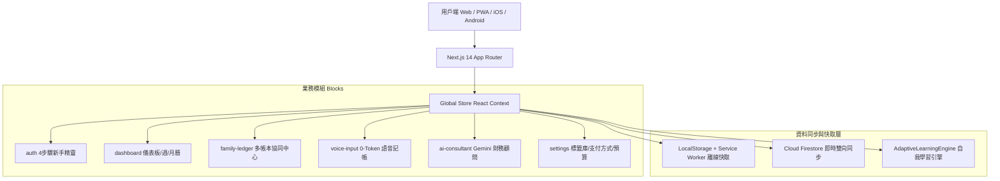

# 📄 智帳君 Ledgy - 產品需求規格書 (PRD)
**版本**：v2.0 (Collaborative Multi-Ledger Edition)  
**最後更新**：2026-09-01  
**產品定位**：專為台灣用戶打造的 0-Token AI 智慧記帳與多人多帳本協同記帳系統

---

## 1. 🎯 產品願景與背景 (Product Vision & Background)

### 1.1 願景 (Vision)
讓個人花銷與多人協同記帳變得「**零阻力、極速、直覺且全端即時同步**」。透過地端 0-Token 自然語言處理與 Gemini 生成式 AI 雙引擎，結合無縫離線快取與 Cloud Firestore 雲端雙向同步，打造跨 Web、iOS 與 Android 的現代化記帳體驗。

### 1.2 核心調整與法規/架構決策 (Key Architectural & Legal Decisions)
1. **👥 多帳本協同模式 (Collaborative Multi-Ledger)**：
   - **全面轉型為「多帳本共編」架構**，支援用戶建立多本獨立帳本（如「個人私帳」、「家庭公帳」、「台北合租」、「日本旅遊」等）。
   - 額外建立的共享帳本支援成員邀請（6 碼邀請碼 / Email 邀請），成員可共同新增、修改與檢視流水帳與獨立預算。
   - **明確廢除舊版 AA 分帳與債務最小化沖銷演算法**，回歸最直覺、透明的共同記帳與預算監控。
2. **⚖️ 發票功能法規政策調整 (Regulatory & Permission Compliance)**：
   - 因**財政部電子發票整合服務平台 API 取得授權與法務權限限制**，系統**暫時關閉電子發票雲端串接與相機發票掃描對獎功能**。
   - 保留**手機條碼載具快速出示功能**（支援超商結帳一秒亮出條碼與一鍵複製），專注於極速 0-Token 語音記帳、手動記帳與多人帳本協同。

---

## 2. 👥 目標客群與使用情境 (User Personas & Scenarios)

| 客群畫像 | 核心痛點 | Ledgy 解決方案 |
| :--- | :--- | :--- |
| **小資/通勤上班族** | 傳統記帳逐筆點選分類耗時，容易放棄。 | 🎙️ **0-Token 語音記帳**：說一句話 0 毫秒自動完成金額、商家、標籤歸類；越用越聰明。 |
| **情侶 / 合租室友 / 家庭** | 需要共同記錄生活開銷，但傳統 App 操作繁瑣或需強制綁定分帳計算。 | 📚 **多帳本共編**：建立「生活公帳」或「旅遊帳本」，成員輸入 6 碼加入即可共同記帳，秒級同步。 |
| **超商/超市實體消費者** | 結帳時翻找載具條碼耗時。 | 💳 **PWA 桌面捷徑一秒亮載具**：長按桌面圖示或點擊頂部條碼，即刻出示高對比條碼。 |

---

## 3. 🧩 核心功能模組需求 (Functional Requirements)

### 3.1 🎙️ 0-Token 在地端 / 雲端混合式 AI 記帳
- **在地端 NLP (0-Token, 0 延遲)**：
  - 內建台灣日常消費詞庫與正則引擎，90% 日常語句（如「*吃麥當勞 160 LINE Pay*」）本機秒解，不產生 API 成本。
- **雲端 Gemini 2.5 Flash 備援**：
  - 遇到長難句或多品項口語時，無縫調用 Gemini 生成式解析。
- **自適應學習閉環 (Adaptive Learning Loop)**：
  - 用戶在 UI 手動修改未歸類標籤時，系統自動提取商家/品項關鍵字，沉澱至專屬學習詞庫，下次輸入 100% 精準匹配。

### 3.2 📚 多帳本中心與多人協同共同編輯 (Collaborative Multi-Ledger)
- **多帳本結構**：
  - **個人私帳 (Personal Ledger)**：僅自己可見的私人帳本。
  - **共享帳本 (Shared/Collaborative Ledgers)**：支援建立無限複數帳本（如「🏠 台北合租」、「✈️ 東京自由行」、「👫 情侶生活」）。
- **協同機制**：
  - **邀請機制**：每本共享帳本具備專屬 6 碼邀請碼與 Email 邀請連結。
  - **共同編輯**：所有成員皆可在該帳本下共同記帳、編輯與刪除明細，透過 Firestore 即時同步。
  - **獨立預算**：每本帳本可設定獨立月預算與進度條監控。
  - **無分帳負擔**：不強加複雜債務分攤計算，專注於各帳本收支透明化。

### 3.3 💳 手機條碼載具快速出示
- **高對比條碼生成**：符合台灣財政部 Code 39 條碼規範，支援自訂載具字號（如 `/AB1234+`）。
- **PWA 桌面捷徑**：支援長按手機桌面圖示直接彈出條碼。
- *(註：電子發票 API 批量拉取與 QR 掃描對獎因法規權限限制暫時關閉)*。

### 3.4 📊 收支看板與多維度統計分析
- **多重視圖**：
  - **總覽列表**：日期降序流水帳，支援標籤多選篩選、日期區間自訂與關鍵字即時搜尋。
  - **週視圖 (Week View)**：柱狀圖呈現本週每日花銷波形。
  - **月曆視圖 (Month Calendar View)**：月曆格子顯示每日支出總和與高額警示。
- **預算與進度**：
  - 頂部即時預算進度條，超支動態變色。
  - 食衣住行分類預算配置與 AI 智慧建議比例。

### 3.5 🤖 Gemini 財務諮詢顧問
- 提供個人/家庭財務健檢對話。
- 支援帶入用戶歷史收支統計，給予客製化省錢與資產配置建議。

---

## 4. 🏗️ 技術架構與非功能性需求 (Technical Architecture)

- **離線優先 (Offline-First)**：無網路狀態下 100% 正常記帳與快取，連網後自動雙向同步。
- **跨平台一致性**：Capacitor 7 + PWA 2.0，支援 iOS Safari 沉浸式透明狀態列、禁用橡皮筋拉扯與 Safe Area 適配。
